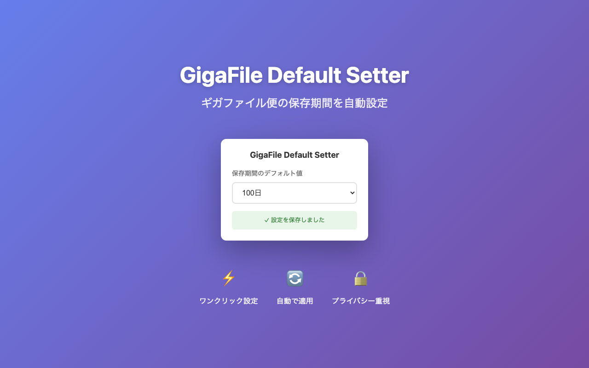

# GigaFile Default Setter

ギガファイル便（gigafile.nu）の保存期間デフォルト値を自動設定するChrome拡張機能

## 機能

- ギガファイル便にアクセス時、保存期間を自動的に設定値に変更
- 3日 / 5日 / 7日 / 14日 / 30日 / 60日 / 100日 から選択可能
- 設定はブラウザに保存され、Googleアカウントでデバイス間同期

## インストール

[Chrome Web Store](https://chromewebstore.google.com/detail/gigafile-default-setter/ekmhmeomjelamfiidhmdnlhfdholcnjp) からインストール

## 使い方

1. ツールバーの拡張機能アイコンをクリック
2. 保存期間のデフォルト値を選択
3. ギガファイル便（gigafile.nu）を開くと自動的に設定が適用される

## スクリーンショット

## プライバシー

この拡張機能は：
- gigafile.nu でのみ動作します
- ユーザーデータを外部に送信しません
- 設定値のみをローカルに保存します

## ライセンス

MIT
